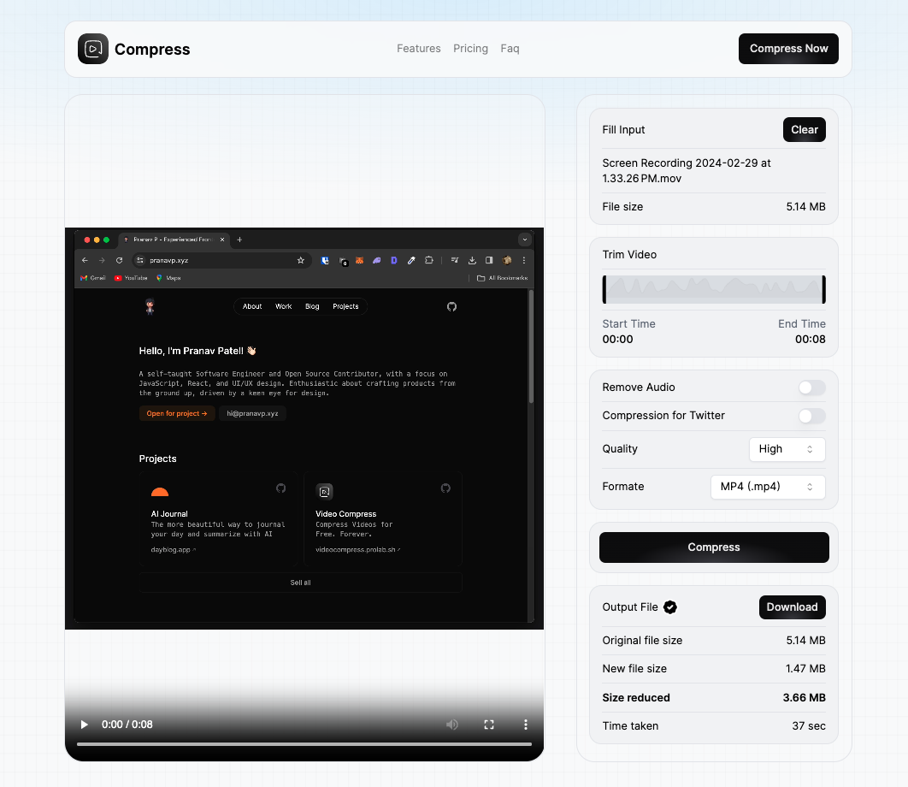

# Video Compression using `FFmpeg`



## Overview

Compress Videos for Free. Forever. Say goodbye to bulky files! Crush video sizes by 90% with no quality loss, even offline. And the best part? It's free!

## ⛰️ Preview

<small>If preview is not loaded, please visit here [preview gif](./public/demo.mp4).</small>


## 🤝 Contributing

### Technologies Used

- **Multimedia Framework:** [FFmpeg](https://ffmpeg.org/)
- **Framework:** [Next.js](https://nextjs.org)
- **Deployment:** [Coolify](https://coolify.io)
- **Styling:** [Tailwind CSS](http://tailwindcss.com)
- **Analytics:** [Plausible](https://plausible.pranavp.xyz/videocompress.prolab.sh)

### Running Locally

Ensure that you have Bun installed.

```bash
git clone https://github.com/pranavp10/video-compress.git
cd video-compress
bun install
bun run dev
```

Create `.env.local` file similar to `.env.example`.

### Deployment

The Video Compression is deployed using [Coolify](https://coolify.io) self hosted. Automatic deployments are triggered when changes are pushed to the main branch.

[Live Video Compression Link](https://videocompress.prolab.sh/)

### License

You are free to use this code as inspiration. Please do not copy it directly. Crediting the author is appreciated. Please remove all personal information (images, etc.)
